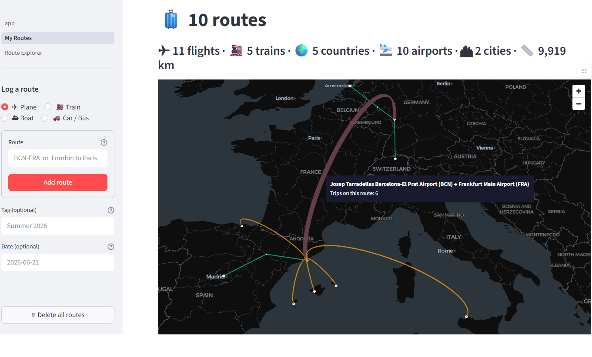
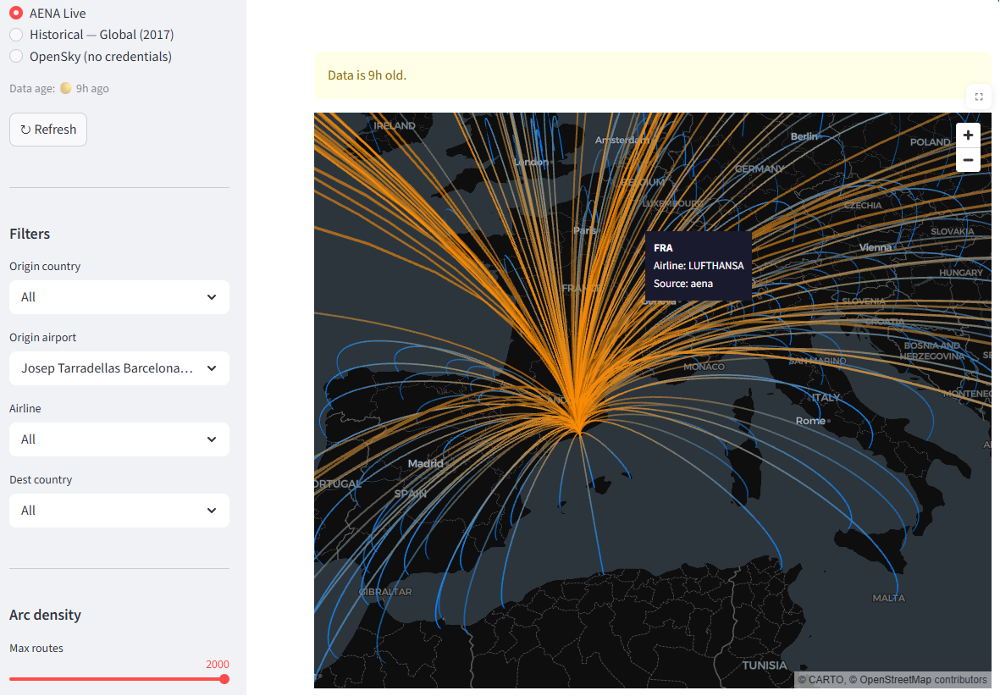

# ✈ PyFly

**Live app: [pyfly-routes.streamlit.app](https://pyfly-routes.streamlit.app/)**

Map your personal travel history and explore the world's flight network.

PyFly has four pages:
- **My Routes** — log every route you've taken (flights, trains, boats, cars). Arcs thicken by how many times you've done the route, coloured by mode or region. Share via URL or export as JSON. Convert any selection into a trip.
- **My Trips** — group routes into named trips with markdown notes. Collapsible cards, each with its own map and region colouring. Reorder, edit, delete, or convert a trip back into individual routes. Unlocked once you save your first trip.
- **Route Explorer** — browse scheduled and historical flight routes as great circle arcs. Explore the live AENA Spanish network, a 2017 global baseline covering 3,400+ airports, or real-time OpenSky records.
- **Airport Explorer** — find airports worldwide on an interactive map. Filter by type and country, look up IATA codes and coordinates.

---

## What it looks like

### My Routes



Log routes by typing `BCN-LHR`, `Paris to London`, or `Frankfurt - Madrid`. Flights render as lifted arcs, ground transport as flat lines. Arcs thicken when you've repeated a route. Stats bar shows total flights, countries, airports, and distance.

### Route Explorer



Each arc represents a direct route. Orange end = origin, blue end = destination.
Hover any arc for the destination code, airline name, and data source.
Filter by origin airport, airline, or destination country. Adjust arc density with
the slider (default 500 — raise it or pick a single airport to see everything).

---

## Data sources

| Source | What | Freshness | Auth |
|---|---|---|---|
| **AENA Live** | Current scheduled routes scraped from aena.es | Monthly (GitHub Actions) | None |
| **Historical (2017)** | OpenFlights open dataset, pre-COVID baseline | Static | None |
| **OpenSky** | Actual flights flown in the last 7 days | On demand, 24h cache | Free account |

---

## Quick start

**Requirements:** Python 3.12+, [uv](https://docs.astral.sh/uv/)

```bash
# Clone and install
git clone <repo-url>
cd PyFly
uv sync --extra scraper      # includes Playwright for the AENA scraper
uv run playwright install chromium

# Populate the database (uses committed parquet snapshots — no scrape needed)
uv run python -m pyfly --source openflights --scope aena

# Or run the live AENA scraper (~4 min, scrapes all 43 airports)
uv run python -m pyfly --source aena --scope aena

# Launch the app
uv run streamlit run pyfly/app.py
```

Open [http://localhost:8501](http://localhost:8501).

---

## Project structure

```
PyFly/
├── pyfly/
│   ├── app.py                  ← Streamlit entry point + navigation
│   ├── pages/
│   │   ├── 1_My_Routes.py      ← Personal travel map + Convert to Trip
│   │   ├── 2_Route_Explorer.py ← Global route explorer (AENA / OpenFlights / OpenSky)
│   │   ├── 3_Airport_Explorer.py ← Airport lookup map
│   │   └── 5_My_Trips.py       ← Trip cards + Convert to Routes
│   ├── sources/
│   │   ├── base.py             ← FlightSource ABC + Scope enum + schema
│   │   ├── aena.py             ← Live Playwright scraper (CLI only)
│   │   ├── openflights.py      ← Historical 2017 source
│   │   └── opensky.py          ← OpenSky REST API + DuckDB cache
│   ├── enrich.py               ← Coordinate + airline name enrichment
│   ├── ingest.py               ← Fetch → enrich → write pipeline
│   ├── db.py                   ← DuckDB read/write + OpenSky cache
│   └── exceptions.py           ← ScraperError, AuthError
├── config/
│   └── airport_urls.json       ← All 43 AENA airports + their page URLs
├── data/
│   ├── airports.csv            ← OurAirports (coordinates + IATA/ICAO mapping)
│   ├── routes.dat              ← OpenFlights routes (~2017)
│   ├── airlines.dat            ← OpenFlights airline names
│   ├── routes_aena.parquet     ← Committed live snapshot (auto-updated by CI)
│   └── routes_openflights.parquet
├── tests/
│   ├── test_aena.py
│   ├── test_openflights.py
│   └── test_opensky.py
├── archive/                    ← Original 2022 scripts (reference only)
└── .github/workflows/
    └── scrape.yml              ← Daily AENA scrape + parquet commit
```

---

## CLI reference

```bash
# AENA live scrape (requires --extra scraper + Playwright)
uv run python -m pyfly --source aena --scope aena

# Historical data (no scraping, reads local files)
uv run python -m pyfly --source openflights --scope aena
uv run python -m pyfly --source openflights --scope european
uv run python -m pyfly --source openflights --scope global_top_100

# OpenSky (requires .env credentials)
uv run python -m pyfly --source opensky --scope aena

# Run tests
uv run pytest tests/ -v
```

---

## OpenSky setup (optional)

Register a free account at [opensky-network.org](https://opensky-network.org), then:

```bash
cp .env.example .env
# Edit .env and add your credentials
OPENSKY_USERNAME=your_username
OPENSKY_PASSWORD=your_password
```

Free tier: 400 API credits/day. Each airport query costs 1 credit.
Results are cached in DuckDB for 24 hours per airport.

---

## Deploying to Streamlit Cloud

1. Push the repo to GitHub — `data/pyfly.ddb` and `.env` are gitignored
2. Connect at [share.streamlit.io](https://share.streamlit.io), set main file: `pyfly/app.py`
3. Add OpenSky credentials as Streamlit Secrets (optional)

The app reads from the committed parquet snapshots on cold start — no scraping
needed in the cloud environment, and no Playwright dependency required.

The GitHub Actions workflow (`.github/workflows/scrape.yml`) runs the AENA scraper
on the 1st of each month at 04:00 UTC and commits the updated parquet back to the repo.
Streamlit Cloud picks up the new commit automatically. It can also be triggered manually
from the GitHub Actions tab.

---

## Adding a new source

1. Create `pyfly/sources/newsource.py` implementing `FlightSource`
2. Add one line to `SOURCES` in `ingest.py`
3. Add the source to the toggle in `pages/1_Route_Map.py`
4. Add `tests/test_newsource.py` following the existing pattern

Nothing else changes.

---

## Tech stack

| | |
|---|---|
| Scraping | Playwright (headless Chromium) + BeautifulSoup4 |
| Data processing | Polars |
| Storage | DuckDB (local) + Parquet (committed snapshots) |
| Visualisation | pydeck ArcLayer + CartoDB basemap |
| App | Streamlit |
| Package management | uv |
| CI/CD | GitHub Actions |

---

*Data sources: [aena.es](https://www.aena.es) · [OpenFlights](https://openflights.org/data.html) · [OpenSky Network](https://opensky-network.org) · [OurAirports](https://ourairports.com/data/)*

---

## Licences and attribution

| Source | Licence | Notes |
|---|---|---|
| [OpenFlights](https://openflights.org/data.html) routes & airlines | [ODbL 1.0](https://opendatacommons.org/licenses/odbl/) | Attribution required; derivative databases must be shared under the same licence |
| [OurAirports](https://ourairports.com/data/) airport data | Public domain | No restrictions |
| [Natural Earth](https://www.naturalearthdata.com/) region boundaries | Public domain | No restrictions |
| [OpenStreetMap](https://www.openstreetmap.org/copyright) (road routing via OSRM, geocoding via Nominatim) | [ODbL 1.0](https://opendatacommons.org/licenses/odbl/) | Must display "© OpenStreetMap contributors" |
| [CARTO](https://carto.com/legal/) Dark Matter basemap tiles | [CC BY 3.0](https://creativecommons.org/licenses/by/3.0/) | Must display "© CARTO" alongside OpenStreetMap attribution |
| [OpenSky Network](https://opensky-network.org/about/terms-of-use) | Non-commercial research | Free-tier API use only; commercial use requires a separate agreement |
| [AENA](https://www.aena.es) route schedules | Scraped from public pages | Factual timetable data; not redistributed — only aggregated route pairs are stored |

This project is intended for **personal and educational use**. The committed AENA parquet snapshot contains only origin–destination pairs derived from publicly accessible schedule pages, not raw page content.

### Copyright

© 2025 Barren-d ([github.com/Barren-d](https://github.com/Barren-d)). Source code is publicly available for personal and educational use. Commercial use requires explicit written permission — see [LICENSE](LICENSE).
